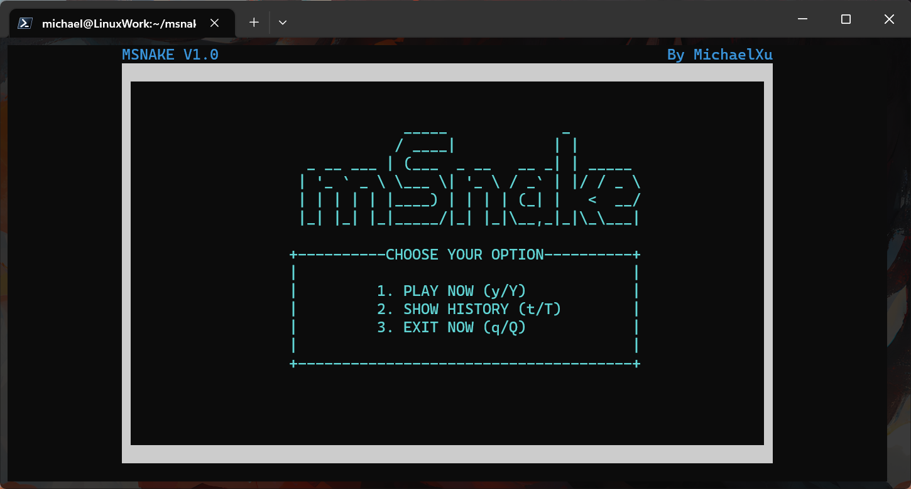
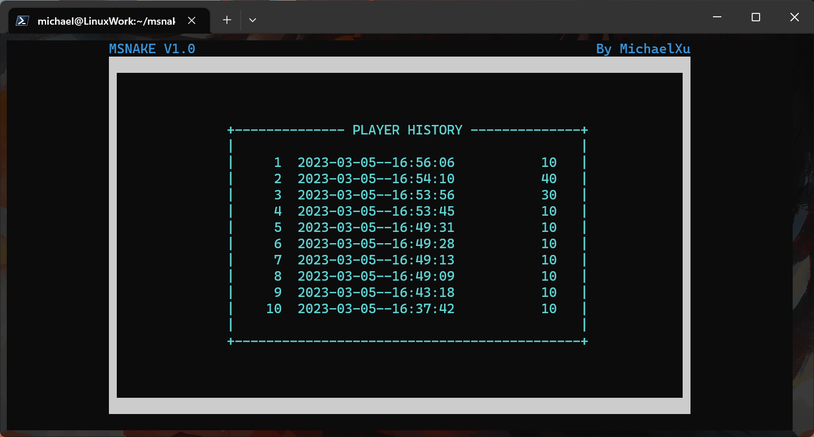
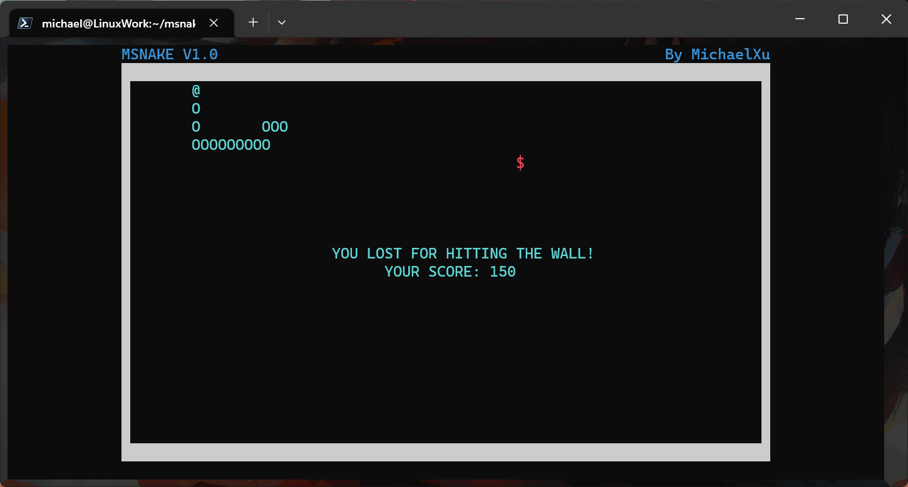

# msnake

## What's this

A Snake game running in your linux terminal.

This program is easy-to-study, easy-to-use and lightweight, you need only 10 minutes to understand all these codes. Even you are a beginner!







## How to install

First, you should compile yourself. But dont worry, just open your terminal, install lib-ncurse and then run the build script in the repo directory.

For Ubuntu/Debian/LinuxMint, run this to install ncurses library

```shell
sudo apt install libncurses-dev
```

For RHEL/Fedora, just run this

```shell
sudo dnf install ncurses-devel
```

And for other distributions, just go to Google and search howto.

After install ncurses library, you can run the following script to compile:

```shell
gcc main.c msnake.h msnake.c snake_main.h snake_main.c snake_data.h snake_data.c -lncurses -O2 -o msnake
```

## Todo

- Better UI
- Change settings
- Change speed while playing
- More things on map (stone, super food...)
